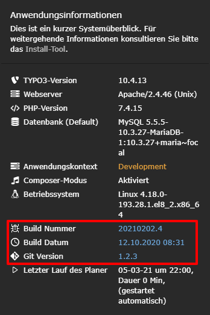

<!-- omit in toc -->
# TYPO3 extension: "buildinfo"

<!-- omit in toc -->
## Content
- [What does it do?](#what-does-it-do)
- [Installation](#installation)
- [Configuration](#configuration)
- [FAQs](#faqs)
  - [How do I create the 3 files?](#how-do-i-create-the-3-files)


## What does it do?
This extension shows the content of 3 different text files in the system information toolbar. These informations are:
- Build number
- Build timestamp
- Git version



## Installation
The extension can easily be installed using composer:
```bash
composer install buildinfo
```

## Configuration
The extension comes with Typoscript settings to configure the names of the 3 files, responsible for the displayed content. The default values are:

- Build number: **buildNumber.txt**
- Build timestamp: **buildTimestamp.txt**
- Git version: **gitVersion.txt**

If a file is not present, no information is shown in the information toolbar.


## FAQs

### How do I create the 3 files?
We use a CI/CD process to build our composer TYPO3 projects into Docker containers. During this process we create 3 files and place them into the containers web folder root directory.
