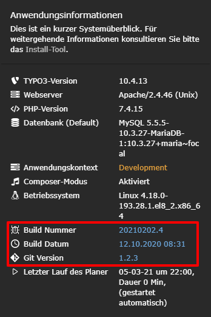

# TYPO3 Extension: Buildinfo

[](https://typo3.org/)
[](LICENSE)

Display build information in the TYPO3 backend system information toolbar, including build numbers, timestamps, and Git version tags.

## Table of Contents

- [TYPO3 Extension: Buildinfo](#typo3-extension-buildinfo)
  - [Table of Contents](#table-of-contents)
  - [Features](#features)
  - [Requirements](#requirements)
  - [Installation](#installation)
    - [Via Composer (recommended)](#via-composer-recommended)
  - [Configuration](#configuration)
    - [Extension Configuration](#extension-configuration)
    - [File Locations](#file-locations)
  - [How It Works](#how-it-works)
    - [Display Logic](#display-logic)
    - [Build Information Display](#build-information-display)
  - [Usage Examples](#usage-examples)
    - [CI/CD Integration](#cicd-integration)
      - [GitLab CI Example](#gitlab-ci-example)
      - [GitHub Actions Example](#github-actions-example)
    - [Docker Builds](#docker-builds)
      - [Dockerfile Example](#dockerfile-example)
    - [Manual Setup](#manual-setup)
    - [Advanced: Custom File Locations](#advanced-custom-file-locations)
  - [Troubleshooting](#troubleshooting)
    - [Information Not Showing](#information-not-showing)
    - [Wrong Timestamp Format](#wrong-timestamp-format)
    - [File Permission Errors](#file-permission-errors)
    - [Docker Container Issues](#docker-container-issues)
  - [Support](#support)
  - [License](#license)
  - [Credits](#credits)
    - [Development](#development)

## Features

- **Build Number Display**: Shows current build number in the backend toolbar
- **Build Timestamp**: Displays when the current build was created with age indicator
- **Git Version**: Shows the Git tag or commit version
- **Flexible Configuration**: Customize file locations via extension configuration
- **CI/CD Ready**: Perfect for Docker-based deployments with automated builds
- **Non-Intrusive**: Only displays information when files are present
- **Auto-Formatting**: Timestamps are automatically formatted as human-readable dates with age
- **Backend Integration**: Seamlessly integrates with TYPO3's system information toolbar

## Requirements

- TYPO3 11.0 - 14.9
- PHP 7.4 or higher

## Installation

### Via Composer (recommended)

```bash
composer require worlddirect/buildinfo
```

## Configuration

### Extension Configuration

Configure file locations through the TYPO3 Extension Manager or by adding to your site's configuration.

| Setting                | Description                                | Default              |
| ---------------------- | ------------------------------------------ | -------------------- |
| **buildNumberFile**    | File containing the build number           | `buildNumber.txt`    |
| **buildTimestampFile** | File containing the build timestamp (Unix) | `buildTimestamp.txt` |
| **gitVersionFile**     | File containing the Git version/tag        | `gitVersion.txt`     |

**Important**: All file paths are relative to your TYPO3 project root directory (`Environment::getProjectPath()`).

### File Locations

By default, the extension looks for files in the project root:
```
/var/www/html/
├── buildNumber.txt
├── buildTimestamp.txt
├── gitVersion.txt
├── public/
└── vendor/
```

You can configure different paths:
```
config/build/buildNumber.txt
config/build/buildTimestamp.txt
config/build/gitVersion.txt
```

## How It Works

### Display Logic

The extension uses TYPO3's PSR-14 `SystemInformationToolbarCollectorEvent` to inject build information into the backend toolbar:

1. **File Check**: For each configured file, the extension checks if it exists
2. **Content Reading**: If a file exists, its content is read
3. **Formatting**: Timestamps are formatted as human-readable dates (e.g., "18.02.2026 14:30:00 (3 days old)")
4. **Toolbar Display**: Information is added to the system information dropdown
5. **Missing Files**: If a file doesn't exist, that information is simply not displayed

### Build Information Display



The toolbar shows:
- **Build Number**: Arbitrary version or build identifier
- **Build Date**: Formatted timestamp with age calculation
- **Git Version**: Tag, branch, or commit hash

## Usage Examples

### CI/CD Integration

#### GitLab CI Example

```yaml
build:
  stage: build
  script:
    # Generate build number
    - echo "${CI_PIPELINE_ID}" > buildNumber.txt
    
    # Generate build timestamp
    - date +%s > buildTimestamp.txt
    
    # Generate Git version
    - git describe --tags --always > gitVersion.txt
    
    # Build your project
    - docker build -t myapp:${CI_PIPELINE_ID} .
```

#### GitHub Actions Example

```yaml
- name: Generate Build Information
  run: |
    echo "${{ github.run_number }}" > buildNumber.txt
    date +%s > buildTimestamp.txt
    git describe --tags --always > gitVersion.txt
```

### Docker Builds

#### Dockerfile Example

```dockerfile
FROM php:8.3-apache

# Your build steps...

# Add build information
ARG BUILD_NUMBER
ARG GIT_VERSION
RUN echo "${BUILD_NUMBER}" > /var/www/html/buildNumber.txt && \
    date +%s > /var/www/html/buildTimestamp.txt && \
    echo "${GIT_VERSION}" > /var/www/html/gitVersion.txt

COPY . /var/www/html/
```

Build with:
```bash
docker build \
  --build-arg BUILD_NUMBER=$(git rev-list --count HEAD) \
  --build-arg GIT_VERSION=$(git describe --tags --always) \
  -t myapp:latest .
```

### Manual Setup

For development or manual deployments:

```bash
# Build number (e.g., incremental number or version)
echo "1.2.3" > buildNumber.txt

# Build timestamp (Unix timestamp)
date +%s > buildTimestamp.txt

# Git version (current tag or commit)
git describe --tags --always > gitVersion.txt
```

### Advanced: Custom File Locations

Configure via extension settings to use a custom directory:

```
builds/current/number.txt
builds/current/timestamp.txt
builds/current/version.txt
```

## Troubleshooting

### Information Not Showing

**Problem**: Build information doesn't appear in the backend toolbar

**Solutions:**
- Verify files exist in the configured location (default: project root)
- Check file permissions (must be readable by web server)
- Ensure files contain valid content (not empty)
- Clear TYPO3 caches: **Admin Tools → Flush Caches**
- Check exact file paths in Extension Manager configuration

### Wrong Timestamp Format

**Problem**: Timestamp shows incorrectly or not at all

**Solutions:**
- Ensure timestamp file contains a Unix timestamp (seconds since epoch)
- Generate with: `date +%s > buildTimestamp.txt`
- Verify file content is numeric: `cat buildTimestamp.txt`
- File should contain only the number, no extra whitespace or newlines

### File Permission Errors

**Problem**: PHP can't read the build information files

**Solutions:**
```bash
# Set appropriate permissions
chmod 644 buildNumber.txt buildTimestamp.txt gitVersion.txt

# Ensure web server user can read
chown www-data:www-data build*.txt gitVersion.txt
```

### Docker Container Issues

**Problem**: Files not present in Docker container

**Solutions:**
- Verify files are created during Docker build process
- Check files are in correct location within container
- Use `docker exec` to inspect container: `docker exec -it container ls -la /var/www/html/`
- Ensure files aren't excluded by `.dockerignore`

## Support

- **Issues**: [GitHub Issues](https://github.com/world-direct-cms/wd-ext-buildinfo/issues)
- **Source Code**: [GitHub Repository](https://github.com/world-direct-cms/wd-ext-buildinfo)
- **Author**: Klaus Hörmann-Engl <kho@world-direct.at>
- **Company**: [World-Direct eBusiness solutions GmbH](https://www.world-direct.at)

## License

This extension is licensed under GPL-2.0-only. See [LICENSE](LICENSE) file for details.

## Credits

Developed and maintained by **Klaus Hörmann-Engl** at [World-Direct eBusiness solutions GmbH](https://www.world-direct.at).

---

**Happy Building! 🚀**
