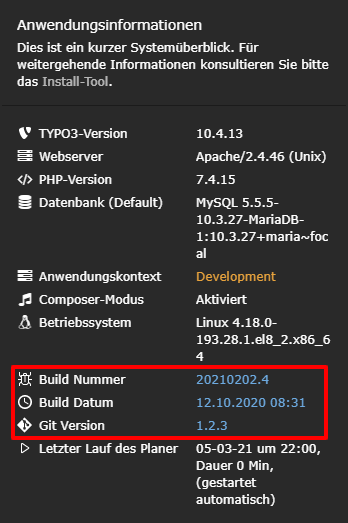

============================
TYPO3 extension: "buildinfo"
============================

This extension shows the content of 3 different text files in the system information toolbar. These informations are:

- Build number
- Build timestamp
- Git version

The extension comes with Typoscript settings to configure the names of the 3 files, responsible for the displayed content. The default values are:

- Build number: **buildNumber.txt**
- Build timestamp: **buildTimestamp.txt**
- Git version: **gitVersion.txt**

Screenshots
^^^^^^^^^^^

How do I create the 3 files?
^^^^^^^^^^^^^^^^^^^^^^^^^^^^

We use a CI/CD process to build our composer TYPO3 projects into Docker containers. During this process we create 3 files and place them into the containers web folder root directory.
